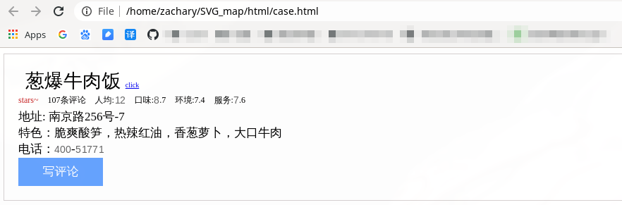

# 信息校验型反爬虫

#### User-Agent 反爬虫

通过校验 `User-Agent` 来区分爬虫. 它是浏览器的身份标识.

##### 绕过

在请求 `url` 时,加入 `headers` 指定请求头.

```python
import requeste

url = ''
headers = {'User-Agent': 'Mozilla/5.0 (X11; Linux x86_64; rv:62.0) Gecko/20100202 Firefox/62.0'}

response = requeste.get(url, headers=headers)
```

#### Cookie 反爬虫

`Cookie` 可以理解为在HTTP 协议下,服务器或其他脚本语言维护客户端信息的一种方式,是保存在客户端的文本协议,`Cookie` 往往包含客户端或用户的相关信息.

*服务器可以通过校验 `Cookie` 中是否包含指定信息来进行反爬虫.*

##### 绕过

```python
import requeste

url = ''
headers = {'Cookie': 'isfirst=789kq7uc1ppuis'}

response = requeste.get(url, headers=headers)
print(response.status_code)
```

通常会使用 `javascipt` 动态生成验证信息,而不会单纯的重复使用相同的验证信息.

#### 签名验证饭爬虫

签名是根据数据源进行计算或加密的过程,签名的结果是一个具有唯一性和一致性的字符串.签名结果的特性使得它成为验证数据来源和数据完整性的条件,可以有效的避免服务器端将伪造的数据或被篡改的数据当成正常数据处理.

可以通过网络分析查看 `data` 中数据参数,解析加密的过程,用相同的加密方式加密,获得正确的签名验证.

案例:[有道翻译验证](https://github.com/zlj-zz/python_/blob/master/anti-crawl_practice/youdao/youdao.py) 

Youdao web translation signature verifivation bypass case.

常使用 `MD5` 加密方式和 `时间戳` 来用作加密基础.

#### WebSocket 握手验证反爬虫

通过在接受客户端的信息后,加入数据的校验流程,若检验通过则向客户端发送信息,否则不做处理.

信息校验主要解决了客户端身份鉴别,数据来源判断和合法性判断等问题,避免了数据接收者使用被篡改过的数据,保证了数据的有效性.

---

# 动态渲染反爬虫
动态网页比静态网页更具有交互性,能给用户更好的使用体验.动态渲染被广泛的应用在 web 网站中,大部分网站会使用 JavaScript 来提升用户体验.


#### 自动执行的异步请求

异步请求能够减少网络请求的时间,从而提升网页加载的速度.将网页分成若干部分,通过异步请求的方式获取数据,可以提高用户体验,减少用户等待时间.

#### 点击事件和计算

点击事件是指用户的鼠标点击按钮或标签等页面元素的操作,这类事件通常会与一个 `JavaScript` 方法绑定在一起, 这里的计算是指使用 `JavaScript` 计算数值并将结果渲染到网页.

#### 下拉加载和异步请求

下来加载实际上是一种翻页操作,翻页和下拉都是为了查看不同的内容.

#### 通用解决方法
了解了动态渲染之后,我们发现动态渲染的技术多样且组合灵活.如果每次遇到之后都要解析网站,分析 JavaScript 代码逻辑,那么时间成本会很高.会常常出现编辑代码只需要 2 小时,而解析网页却花费好几天的时间.

有没有通用的解决方案吗?

1. **Selenium 套件**. 
    
    Selenium 是一个用于测试 web 程序的自动化工具.我们可以使用 Selenium 和浏览器驱动调用浏览器执行特定的操作.由于调用了浏览器,所以具备了资源自动加载和渲染的能力.
2. **异步渲染库 Puppeteer**.

    使用 Selenium 有一定的缺陷,当我们使用 Python 中的异步库编写爬虫时, Selenium就不是那么合适了.异步是目前提升爬虫效率的常用手段之一,由于浏览器是以进程的方式启动,所以无法满足异步爬虫的渲染需求.因为异步爬虫的请求效率很高,而开启过多的进程是不太现实的.

    Puppeteer 是 Google 开源的 Node 库,更重要的是 Pupeteer 支持异步. Puppeteer 是一个 Node 库, 如果你的爬虫是使用 Node.js 编写的,那么可以直接使用 Puppeteer 支持异步,如果是 Python 写的,需要用支持 Python 的库 Pypeteer.

3. **异步渲染服务 Splash** 

    如果是分布式爬虫,那么在每一台机器上配置 Selenium 和 Pypeteer 是非常麻烦的.Splash 是一个异步的 JavaScript 渲染服务,它是带有 HTTP API 的轻量级 web 浏览器.Splash 能够并行的处理多个页面请求.

---

# 文本混淆反爬虫
文本混淆反爬虫可以有效的避免爬虫获取 web 中 重要的文字信息.

#### 图片伪装反爬虫
图片伪装是指将带有文字的图片和正常的文字混合在一起,达到混淆的效果.它不会影响用户获取信息,但可以让爬虫拿不到真正的数据.

##### 绕过
[用户信息爬取案例](https://github.com/zlj-zz/anti-crawl_case/tree/master/picture_disguise) 

#### CSS 偏移反爬虫
CSS 偏移反爬虫指的是利用 CSS 样式将乱序的文字排版为正常人类阅读理解的顺序.

##### 绕过
[获取机票价格案例](https://github.com/zlj-zz/anti-crawl_case/tree/master/css_offset) 

 

#### SVG 映射反爬虫
SVG 是用于描述二位矢量图形的一种图形格式.它基于 xml 描述图形,对图形进行缩放操作都不会i影响图形质量,这个特性导致矢量图被广泛应用与 web 网站中.

##### 绕过
[爬取联系电话案例](https://github.com/zlj-zz/anti-crawl_case/tree/master/SVG_map) 

 
#### 字体反爬虫

#### 文本混淆反爬虫通用解决方法

---

# 特征识别反爬虫

#### WebDriver 识别

#### 浏览器特征

#### 爬虫特征

#### 隐藏链接反爬虫

---

# 验证码


#### 字符验证码

#### 计算型验证码
计算型验证码实在字符验证码的基础上增加了数学运算,它也是将人类视觉和计算机视觉的差异作为区分用户的依据.

##### 绕过

[calculation-vrify](https://github.com/zlj-zz/anti-crawl_case/tree/master/calculation_vrify) 

Calculation validation bypas case.

you should install `tesseract` and `pytesseract`, if you are `Ubuntu` like:
```shell
sudo apt install tesseract-ocr --fix-missing
sudo apt install libtesseract-dev --fix-missing

pip install pytesseract
```


#### 滑动验证码
开发者试图通过从行为方面区分人机.我们认为计算机难于i准确的完成鼠标点击,拖拽,释放等行为,于是开发了滑动验证码.

##### 绕过

[slide-verify](https://github.com/zlj-zz/anti-crawl_case/tree/master/slide_vrify) 

    Slider validation bypass case.

    you should install `selenium`,like:
    ```shell
    pip install selenium
    ```


